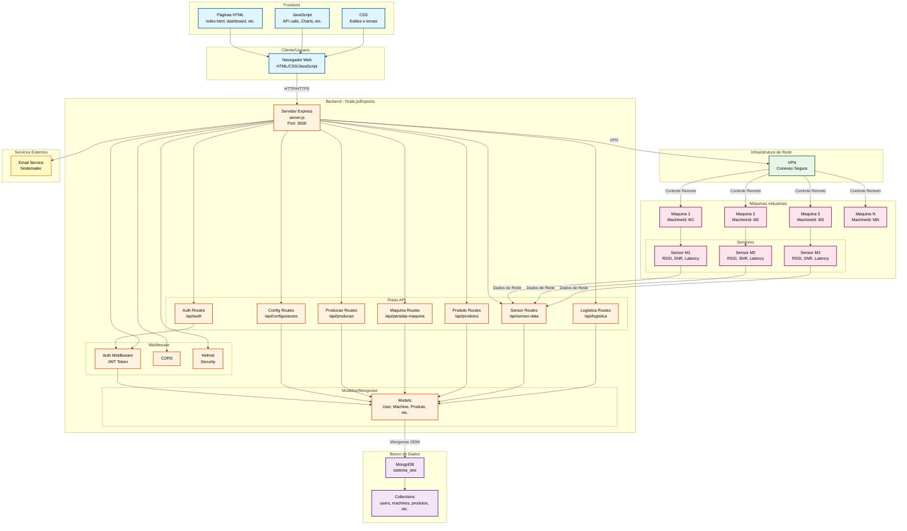

# Diagrama de Arquitetura
## Sistema de Monitoramento OEE (Overall Equipment Effectiveness)

## Descrição dos Componentes

### Frontend
- **Navegador Web**: Interface do usuário
- **Páginas HTML**: Telas do sistema (dashboard, cadastros, relatórios)
- **JavaScript**: Lógica do cliente, chamadas à API, gráficos
- **CSS**: Estilização e temas

### Backend
- **Servidor Express**: Servidor HTTP principal na porta 3000
- **Rotas API**: Endpoints RESTful para autenticação, configurações, produção, etc.
- **Middleware**: Autenticação JWT, CORS, segurança (Helmet)
- **Modelos**: Schemas Mongoose para validação e manipulação de dados

### Banco de Dados
- **MongoDB**: Banco de dados NoSQL
- **Collections**: Coleções de documentos (users, machines, produtos, etc.)

### Infraestrutura de Rede
- **VPN**: Conexão segura para acesso remoto às máquinas
  - Permite ligar/desligar máquinas remotamente
  - Permite editar configurações das máquinas
  - Conexão criptografada para segurança

### Máquinas Industriais
- **Máquinas Físicas**: Equipamentos de produção
- **Sensores**: Coletam dados de rede (RSSI, SNR, Latência, Throughput)
  - Enviam dados periodicamente para o backend
  - Monitoramento em tempo real

### Serviços Externos
- **Email Service**: Envio de notificações e emails (via Nodemailer)

