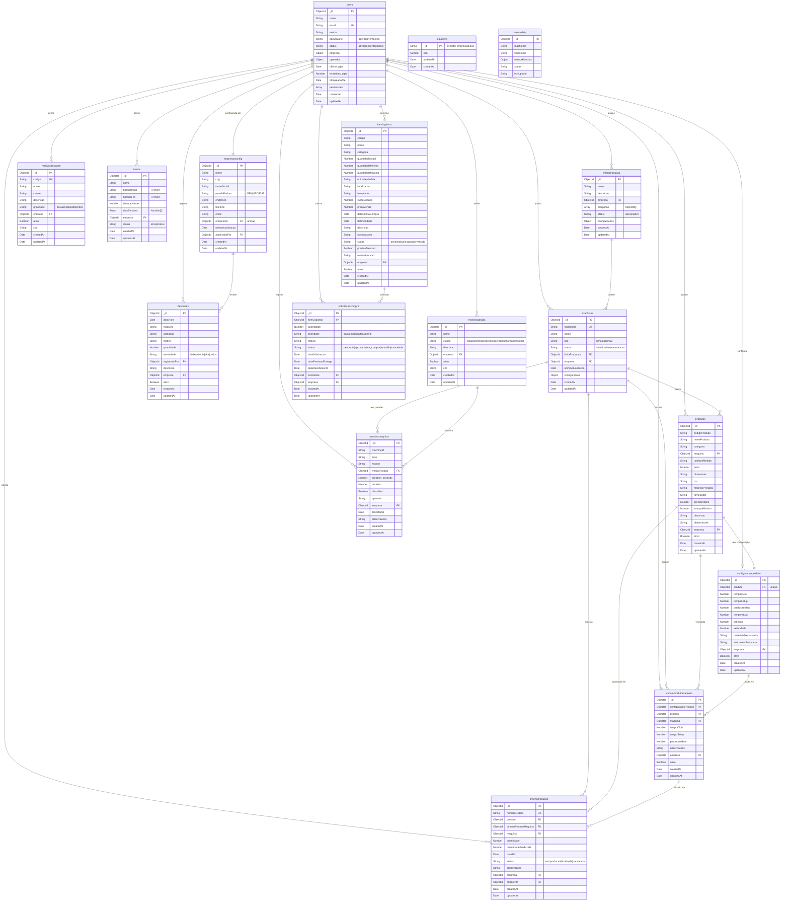

# Diagrama do Banco de Dados
## Sistema de Monitoramento OEE - MongoDB Collections e Relacionamentos

## Índices Principais

### Collection: users
- `email` (unique)
- `tipoUsuario`
- `status`
- `empresa.cnpj` (unique, partial)

### Collection: machines
- `machineId` (unique)
- `empresa`
- `linhaProducao`
- `status`

### Collection: produtos
- `codigoProduto`
- `empresa`
- `maquina`
- `categoria`
- `ativo`
- `empresa, createdAt` (composto)

### Collection: ordensproducao
- `numeroOrdem` (unique, sparse)
- `empresa`
- `maquina`
- `status`
- `createdAt`
- `empresa, maquina, status, createdAt` (composto)

### Collection: paradasmaquina
- `machineId`
- `empresa`
- `timestamp`
- `classified`
- `reason`
- `empresa, timestamp` (composto)

### Collection: descartes
- `dataHora`
- `maquina`
- `categoria`
- `severidade`
- `empresa`
- `ativo`
- `empresa, dataHora` (composto)

### Collection: vinculoprodutomaquina
- `produto, maquina, empresa` (unique, composto)
- `empresa`
- `ativo`
- `empresa, ativo` (composto)

### Collection: turnos
- `empresa, status`
- `nome`
- `empresa`

### Collection: itemlogistica
- `codigo, empresa` (composto)
- `empresa`
- `status`
- `precisaAtencao`
- `dataValidade`
- `empresa, status, precisaAtencao` (composto)

### Collection: sensordata
- `machineId`
- `timestamp`
- `machineId, timestamp` (composto)

## Observações Importantes

1. **Relacionamentos**:
   - Todos os modelos principais referenciam `users` através do campo `empresa` (ObjectId)
   - `EmpresaConfig` tem relação 1:1 com `User` através de `empresaId`
   - `Produto` → `Machine` é obrigatório
   - `ConfiguracaoProduto` → `Produto` é único (1:1)
   - `VinculoProdutoMaquina` combina Produto + Máquina + Empresa de forma única

2. **Coleções Adicionais**:
   - `sensordata`: Dados de sensores de rede das máquinas (não modelado com Mongoose)
   - `counters`: Utilizada para geração sequencial de números de ordem

3. **Campos de Timestamp**:
   - Todas as coleções principais têm `createdAt` e `updatedAt` (timestamps automáticos)
   - Alguns modelos têm campos de timestamp específicos (`dataHora`, `timestamp`, `ultimaAtualizacao`)

4. **Soft Delete**:
   - Várias coleções usam campo `ativo` para soft delete em vez de remoção física

5. **Enums**:
   - Status, tipos e enums são validados no nível do schema Mongoose
   - Valores permitidos são documentados nos comentários dos diagramas

