# Diagrama de Classes
## Sistema de Monitoramento OEE - Modelos e Relações

```mermaid
classDiagram
    class User {
        +ObjectId _id
        +String nome
        +String email
        +String senha
        +String tipoUsuario
        +String status
        +Object empresa
        +Object operador
        +Date ultimoLogin
        +Number tentativasLogin
        +Date bloqueadoAte
        +Array permissoes
        +Date createdAt
        +Date updatedAt
        +verificarSenha(senha)
        +estaBloqueado()
        +incrementarTentativas()
        +resetarTentativas()
    }

    class Machine {
        +ObjectId _id
        +String machineId
        +String nome
        +String tipo
        +String status
        +ObjectId linhaProducao
        +ObjectId empresa
        +Date ultimaAtualizacao
        +Object configuracoes
        +Date createdAt
        +Date updatedAt
    }

    class EmpresaConfig {
        +ObjectId _id
        +String nome
        +String cnpj
        +String razaoSocial
        +String moedaPadrao
        +String endereco
        +String telefone
        +String email
        +ObjectId empresaId
        +Date ultimaAtualizacao
        +ObjectId atualizadoPor
        +Date createdAt
        +Date updatedAt
    }

    class LinhaProducao {
        +ObjectId _id
        +String nome
        +String descricao
        +ObjectId empresa
        +Array maquinas
        +String status
        +Object configuracoes
        +Date createdAt
        +Date updatedAt
    }

    class Produto {
        +ObjectId _id
        +String codigoProduto
        +String nomeProduto
        +String categoria
        +ObjectId maquina
        +String unidadeMedida
        +Number peso
        +String dimensoes
        +String cor
        +String materialPrincipal
        +String fornecedor
        +Number precoUnitario
        +Number estoqueMinimo
        +String descricao
        +String observacoes
        +ObjectId empresa
        +Boolean ativo
        +Date createdAt
        +Date updatedAt
    }

    class ConfiguracaoProduto {
        +ObjectId _id
        +ObjectId produto
        +Number tempoCiclo
        +Number tempoSetup
        +Number producaoIdeal
        +Number temperatura
        +Number pressao
        +Number velocidade
        +String materiaisNecessarios
        +String instrucoesFabricacao
        +ObjectId empresa
        +Boolean ativo
        +Date createdAt
        +Date updatedAt
    }

    class VinculoProdutoMaquina {
        +ObjectId _id
        +ObjectId configuracaoProduto
        +ObjectId produto
        +ObjectId maquina
        +Number tempoCiclo
        +Number tempoSetup
        +Number producaoIdeal
        +String observacoes
        +ObjectId empresa
        +Boolean ativo
        +Date createdAt
        +Date updatedAt
    }

    class OrdemProducao {
        +ObjectId _id
        +String numeroOrdem
        +ObjectId produto
        +ObjectId vinculoProdutoMaquina
        +ObjectId maquina
        +Number quantidade
        +Number quantidadeProduzida
        +Date dataFim
        +String status
        +String observacoes
        +ObjectId empresa
        +ObjectId criadoPor
        +Date createdAt
        +Date updatedAt
    }

    class Turno {
        +ObjectId _id
        +String nome
        +String horarioInicio
        +String horarioFim
        +Number duracaoHoras
        +Array diasSemana
        +ObjectId empresa
        +String status
        +Date createdAt
        +Date updatedAt
    }

    class ParadaMaquina {
        +ObjectId _id
        +String machineId
        +String type
        +String reason
        +ObjectId motivoParada
        +Number duration_seconds
        +Number duration
        +Boolean classified
        +String operator
        +ObjectId empresa
        +Date timestamp
        +String observacoes
        +Date createdAt
        +Date updatedAt
    }

    class MotivoParada {
        +ObjectId _id
        +String nome
        +String classe
        +String descricao
        +ObjectId empresa
        +Boolean ativo
        +String cor
        +Date createdAt
        +Date updatedAt
    }

    class Descarte {
        +ObjectId _id
        +Date dataHora
        +String maquina
        +String categoria
        +String motivo
        +Number quantidade
        +String severidade
        +ObjectId registradoPor
        +String descricao
        +ObjectId empresa
        +Boolean ativo
        +Date createdAt
        +Date updatedAt
    }

    class MotivoDescarte {
        +ObjectId _id
        +String codigo
        +String nome
        +String classe
        +String descricao
        +String gravidade
        +ObjectId empresa
        +Boolean ativo
        +String cor
        +Date createdAt
        +Date updatedAt
    }

    class ItemLogistica {
        +ObjectId _id
        +String codigo
        +String nome
        +String categoria
        +Number quantidadeAtual
        +Number quantidadeMinima
        +Number quantidadeMaxima
        +String unidadeMedida
        +String localizacao
        +String fornecedor
        +Number custoUnitario
        +Number precoVenda
        +Date dataUltimaCompra
        +Date dataValidade
        +String descricao
        +String observacoes
        +String status
        +Boolean precisaAtencao
        +String motivoAtencao
        +ObjectId empresa
        +Boolean ativo
        +Date createdAt
        +Date updatedAt
    }

    class SolicitacaoCompra {
        +ObjectId _id
        +ObjectId itemLogistica
        +Number quantidade
        +String prioridade
        +String motivo
        +String status
        +Date dataSolicitacao
        +Date dataPrevisaoEntrega
        +Date dataRecebimento
        +ObjectId solicitante
        +ObjectId empresa
        +Date createdAt
        +Date updatedAt
    }

    class Counter {
        +String _id
        +Number seq
        +Date updatedAt
        +Date createdAt
    }

    %% Relacionamentos
    User "1" --> "*" Machine : empresa
    User "1" --> "1" EmpresaConfig : empresaId
    User "1" --> "*" OrdemProducao : criadoPor
    User "1" --> "*" Descarte : registradoPor
    User "1" --> "*" SolicitacaoCompra : solicitante
    User "1" --> "*" SolicitacaoCompra : empresa
    User "1" --> "*" Turno : empresa
    User "1" --> "*" Produto : empresa
    User "1" --> "*" ConfiguracaoProduto : empresa
    User "1" --> "*" VinculoProdutoMaquina : empresa
    User "1" --> "*" ItemLogistica : empresa
    User "1" --> "*" MotivoParada : empresa
    User "1" --> "*" MotivoDescarte : empresa
    User "1" --> "*" ParadaMaquina : empresa

    Machine "1" --> "*" Produto : maquina
    Machine "1" --> "*" VinculoProdutoMaquina : maquina
    Machine "1" --> "*" OrdemProducao : maquina
    Machine "1" --> "*" ParadaMaquina : machineId
    Machine "*" --> "1" LinhaProducao : linhaProducao
    Machine "*" --> "1" User : empresa

    LinhaProducao "1" --> "*" Machine : maquinas
    LinhaProducao "*" --> "1" User : empresa

    Produto "1" --> "1" ConfiguracaoProduto : produto
    Produto "1" --> "*" VinculoProdutoMaquina : produto
    Produto "1" --> "*" OrdemProducao : produto
    Produto "*" --> "1" Machine : maquina
    Produto "*" --> "1" User : empresa

    ConfiguracaoProduto "1" --> "*" VinculoProdutoMaquina : configuracaoProduto
    ConfiguracaoProduto "1" --> "1" Produto : produto
    ConfiguracaoProduto "*" --> "1" User : empresa

    VinculoProdutoMaquina "*" --> "1" ConfiguracaoProduto : configuracaoProduto
    VinculoProdutoMaquina "*" --> "1" Produto : produto
    VinculoProdutoMaquina "*" --> "1" Machine : maquina
    VinculoProdutoMaquina "*" --> "1" User : empresa

    OrdemProducao "1" --> "1" Produto : produto
    OrdemProducao "1" --> "1" VinculoProdutoMaquina : vinculoProdutoMaquina
    OrdemProducao "1" --> "1" Machine : maquina
    OrdemProducao "*" --> "1" User : empresa
    OrdemProducao "*" --> "1" User : criadoPor

    ParadaMaquina "*" --> "1" MotivoParada : motivoParada
    ParadaMaquina "*" --> "1" User : empresa

    MotivoParada "*" --> "1" User : empresa

    Descarte "*" --> "1" User : registradoPor
    Descarte "*" --> "1" EmpresaConfig : empresa

    MotivoDescarte "*" --> "1" User : empresa

    ItemLogistica "1" --> "*" SolicitacaoCompra : itemLogistica
    ItemLogistica "*" --> "1" User : empresa

    SolicitacaoCompra "*" --> "1" ItemLogistica : itemLogistica
    SolicitacaoCompra "*" --> "1" User : solicitante
    SolicitacaoCompra "*" --> "1" User : empresa

    EmpresaConfig "1" --> "1" User : empresaId
```

## Descrição das Classes

### User (Usuário)
Classe principal para autenticação e autorização. Representa dois tipos de usuários:
- **Operador**: Funcionário que opera máquinas
- **Empresa**: Cliente/empresa que utiliza o sistema

**Métodos principais:**
- `verificarSenha()`: Valida senha com hash bcrypt
- `estaBloqueado()`: Verifica se usuário está bloqueado por tentativas
- `incrementarTentativas()`: Incrementa tentativas de login
- `resetarTentativas()`: Reseta tentativas após login bem-sucedido

### Machine (Máquina)
Representa uma máquina industrial física ou simulada.

**Relações:**
- Pertence a uma `LinhaProducao`
- Pertence a uma `Empresa` (User)
- Pode ter múltiplos `Produto`
- Tem múltiplas `ParadaMaquina`

### Produto (Produto)
Representa um produto fabricado em uma máquina.

**Relações:**
- Pertence a uma `Machine`
- Tem uma `ConfiguracaoProduto`
- Pode ter múltiplos `VinculoProdutoMaquina`
- Usado em `OrdemProducao`

### ConfiguracaoProduto (Configuração de Produto)
Armazena parâmetros de produção para um produto (tempo de ciclo, setup, etc.).

### VinculoProdutoMaquina (Vínculo Produto-Máquina)
Relaciona um produto a uma máquina específica com parâmetros de produção.

### OrdemProducao (Ordem de Produção)
Representa uma ordem de produção com quantidade, status e progresso.

### Turno (Turno)
Define turnos de trabalho com horários e dias da semana.

### ParadaMaquina (Parada de Máquina)
Registra paradas de máquinas com motivo e duração.

### MotivoParada (Motivo de Parada)
Catálogo de motivos de parada classificados por classe.

### Descarte (Descarte)
Registra produtos descartados com motivo e severidade.

### MotivoDescarte (Motivo de Descarte)
Catálogo de motivos de descarte.

### ItemLogistica (Item de Logística)
Gerencia estoque e materiais necessários para produção.

### SolicitacaoCompra (Solicitação de Compra)
Gerencia solicitações de compra de itens de logística.

### Counter (Contador)
Utilitário para geração sequencial de números (ex: números de ordem de produção).

